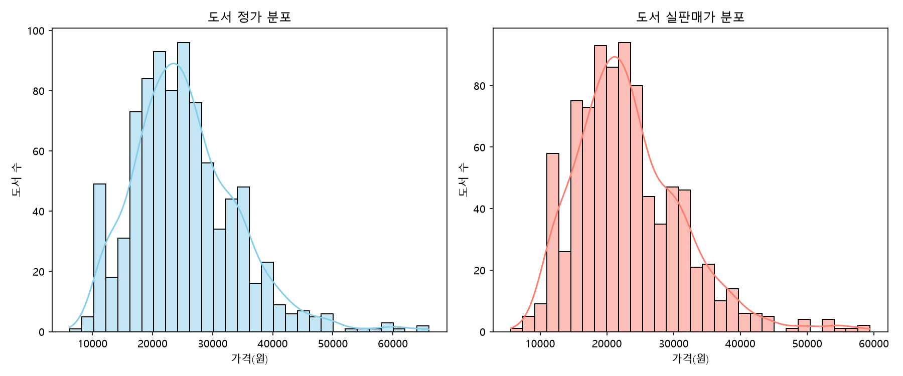
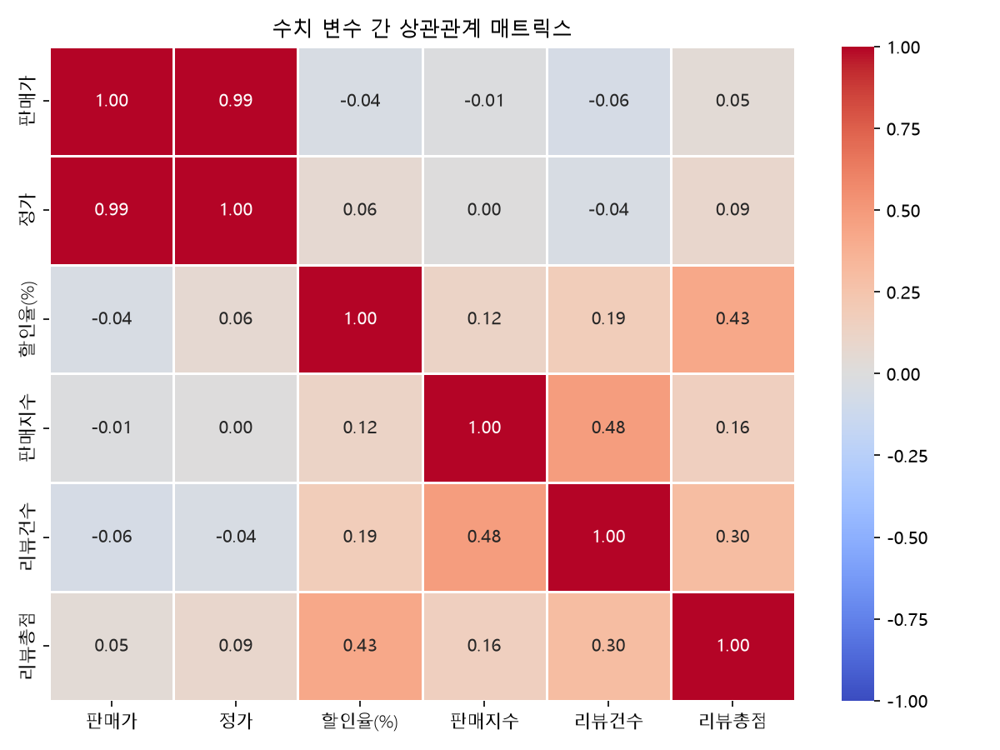
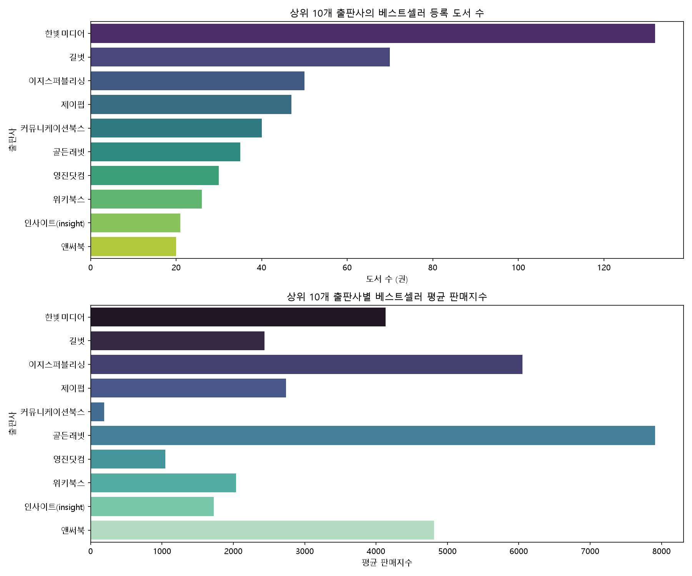
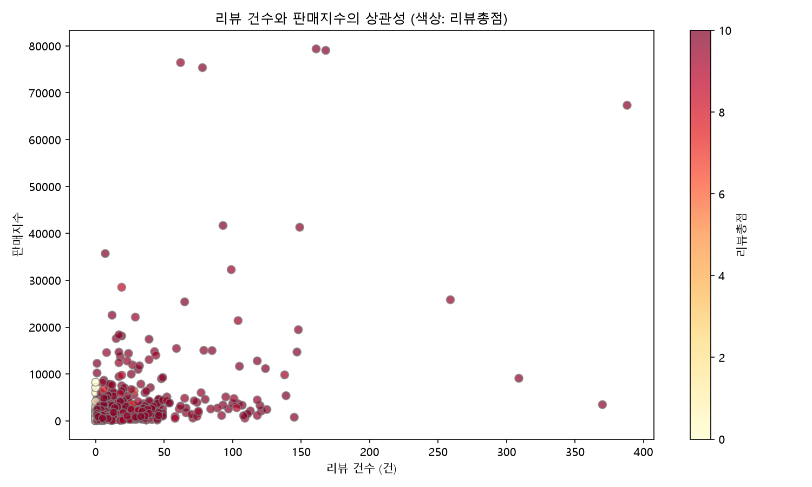
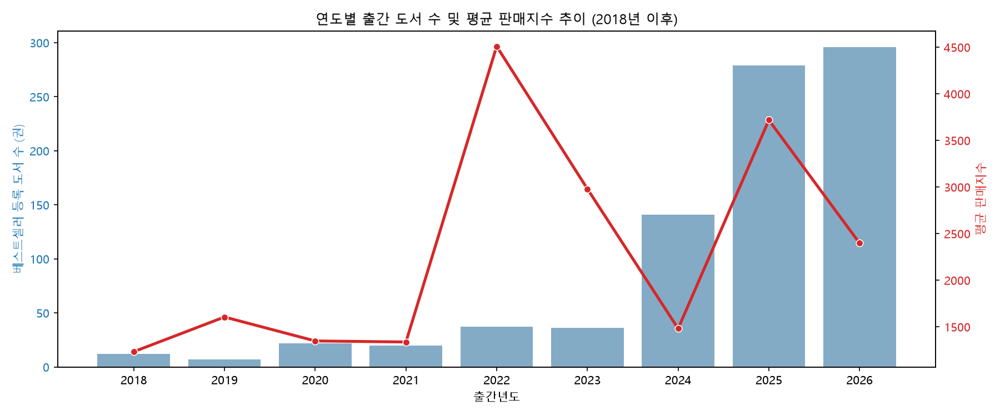

# Walkthrough - YES24 IT/모바일 베스트셀러 EDA 완료 보고서

YES24 IT/모바일 종합 베스트셀러 도서 데이터([yes24_bestseller.csv](../data/yes24_bestseller.csv))를 분석하여 시각화 차트를 도출하고 종합 분석 보고서를 성공적으로 완성했습니다.

## 1. 수행한 주요 분석 작업

1. **데이터 정제 및 파생변수 생성**:
   - `정가`, `판매가`, `할인율(%)`, `판매지수`, `리뷰건수`, `리뷰총점` 등 수치 컬럼들을 정밀하게 자료형 변환하여 통계 분석에 적합하도록 전처리했습니다.
   - `출판일` 컬럼에서 정규표현식을 사용하여 `출간년도`와 `출간월` 파생 변수를 성공적으로 분리 생성했습니다.
2. **시각화 그래프 생성 (5종)**:
   - `price_dist.png`: 도서 정가와 실판매가의 분포 비교 시각화 (KDE 및 히스토그램)
   - `correlation_matrix.png`: 수치 변수 간의 피어슨 상관계수 Heatmap 분석
   - `top_publishers.png`: 베스트셀러 진입 수 기준 상위 10개 출판사의 점유율 및 해당 출판사들의 평균 판매지수 시각화
   - `sales_vs_reviews.png`: 리뷰 건수와 판매지수의 산점도 관계도 (리뷰 총점을 색상 맵으로 결합)
   - `trend_by_year.png`: 연도별 출간 권수 및 평균 판매지수의 상호 작용 추이 (이중 Y축 차트)
3. **분석 보고서 자동 렌더링**:
   - 파이썬 스크립트 실행 결과를 활용해 기초 통계 요약 및 통찰을 상세 서술한 종합 보고서([eda_report.md](./eda_report.md))를 자동으로 생성했습니다.

---

## 2. 생성된 산출물 목록 및 경로 (상대경로/절대경로)

- **종합 분석 보고서**: [eda_report.md](./eda_report.md)
- **EDA 실행 파이썬 코드**: [eda_analysis.py](../src/eda_analysis.py)
- **시각화 이미지 디렉터리**: [images 폴더](../images)

---

## 3. 분석 시각화 결과물 확인

아래 이미지는 [yes24/images](../images) 디렉터리에 저장된 최종 생성 차트들입니다.

### 3.1 가격 분포
정가와 판매가의 분포를 통해 대다수의 IT/모바일 분야 도서들이 15,000원에서 30,000원 대에 조밀하게 몰려 있음을 보입니다.

### 3.2 수치 변수 간 상관관계 매트릭스
리뷰의 개수와 책의 판매 성과(판매지수) 사이에는 `0.48`로 가장 유의미한 양의 상관관계가 나타납니다.

### 3.3 상위 10개 출판사 분석
베스트셀러 등극 1위는 `한빛미디어`(132권)이나, 평균 판매 성과(평균 판매지수) 측면에서는 다른 브랜드 파워를 지닌 출판사들도 강력한 효율을 보이고 있습니다.

### 3.4 리뷰 건수와 판매지수 산점도
리뷰 건수가 누적될수록 판매 성과가 기하급수적으로 폭발하는 롱테일 현상이 확인되며, 대다수 흥행 서적들의 평점은 9점 이상으로 매우 우수합니다.

### 3.5 연도별 출간 도서 및 판매지수 추이
트렌드 교체 주기가 매우 빠른 IT 업계 특성상, 최근(2024~2026년) 출간된 최신 신간 도서들이 베스트셀러 진입 점유율의 지배적인 비중을 차지합니다.

